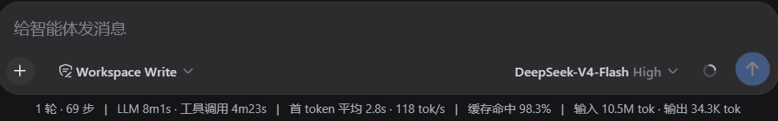

# dsh-cache-hit-decimal

> **Discontinued (2026-09-12) — the official client now does this.**
> DeepSeek Harness renders the cache-hit rate with two decimals on its own: the official
> `@deepseek-ai/dsh-client-ui-chat` package ships the `cache-hit-2dp` formatting (verified in
> `0.1.5-rc.2`) and uses it in both the composer stats line and the turn-usage panel. That was
> this plugin's only purpose, so it is redundant now — **this repository is no longer updated and
> no further versions will be published.** The last published release (`0.2.0`) stays on npm for
> older runtimes; everything below is kept for reference.

A small DeepSeek Harness Web plugin that replaces the native integer cache-hit percentage with a two-decimal value, such as `42.86%`.



It shadows the existing `stats` cell in `conversation.composer.dock` instead of patching the official conversation package. Removing the plugin restores the native integer display.

[中文说明](README.zh.md)

## Install

```sh
dsh plugin --profile web add @yuuu0109/dsh-cache-hit-decimal
```

Restart the `dsh web` process and refresh the browser.

## Update

```sh
dsh plugin --profile web update @yuuu0109/dsh-cache-hit-decimal
```

Restart `dsh web` and refresh the browser. If a configured npm mirror has not synced the latest version yet, use the official registry:

```sh
dsh plugin --profile web update @yuuu0109/dsh-cache-hit-decimal --registry=https://registry.npmjs.org/
```

pnpm 11 may delay newly published versions for 24 hours. To update immediately:

```sh
dsh plugin --profile web update @yuuu0109/dsh-cache-hit-decimal@0.2.1 --config.minimumReleaseAge=0
```

## Install from source

```sh
git clone https://github.com/Yuuu0109/dsh-cache-hit-decimal.git
cd dsh-cache-hit-decimal
pnpm install
pnpm build
dsh plugin --profile web add .
```

## Changelog

### 0.2.1

Fixes the line being invisible on current DeepSeek Harness (verified against `0.1.5-rc.1`), and makes the two-decimal promise actually hold.

- **Fixed the module-graph direction, which hid the whole line.** `dsh.client.inject` listed renderer / session / conversation / **chat** / primitives, but `conversation.composer.dock` is declared by `dsh-client-ui-conversation`, and `useChat` is a **conversation** standard prop. The plugin loaded under `chat`, while `conversation` only merges `renderer`/`session`/`ui-conversation` — so the slot was never declared, registration threw `slot "conversation.composer.dock" is not declared`, and the entry failed to activate. `inject` is now `["@deepseek-ai/dsh-client-ui-conversation", "@deepseek-ai/dsh-client-ui-chat"]`.
- **Fixed the i18n keys, which rendered as raw text.** The plugin registered with `locale: 'chat'` and read `stats.llm`, `stats.toolCall`, `stats.ttftAverage`, `stats.tokensPerSecond` and `stats.tokens`. None of those exist in the Chat dictionary, and the locale runtime returns **the key itself** for an unknown key, so the line printed literal `stats.llm · stats.toolCall`. It now owns a `cache-hit-decimal` namespace (zh/en) registered at apply time, with a built-in dictionary fallback.
- **The cache-hit rate now really shows two decimals.** `cacheHitPercent` returned a `number`, and `t('stats.cacheHit', { percent })` stringified it — so `60.00` was rendered as `60`, and `42.86%` was never two decimals. It now returns formatted text.
- **Never rounds a partial hit up to `100.00`.** `Math.round(hit / total * 10000) / 100` turns 99.997% into 100.00, which defeats the purpose of a cache-hit readout. Ported the official `formatCacheHitPercent` algorithm: an integer binary search for the exact hundredths, plus the honesty rule that keeps a partial hit below 100 at the cost of extra digits.
- **Dropped the `@deepseek-ai/dsh-client-ui-primitives` dependency.** The hover tooltip now rides a native `title` attribute.
- **Renders in more compositions.** A `tokenUsage` value now shows the token groups even when the `sessionStats` projection is absent (0.2.0 rendered nothing in that case), and a missing locale service falls back to the built-in dictionary.

### 0.2.0

- Adapted to DeepSeek Harness `0.1.2-alpha.4`: dependencies and peers moved from `0.1.0-rc.6` to `0.1.2-alpha.4`.
- The stats line now reads the host-computed `sessionStats` and `tokenUsage` projections through the standard session hooks (`useProjection` / `useChat`), with the legacy node fold kept as fallback.
- Slot registration updated to the current list-slot contract (`id`/`order`/`priority`, `locale: 'chat'`); the native `stats` cell is still shadowed at priority `-1`, and removing the plugin restores the integer display.

### 0.1.4

- Display the full stats line on one centered row without wrapping or an ellipsis.

### 0.1.3

- Display the cache-hit rate with two decimal places.

## Uninstall

```sh
dsh plugin --profile web remove @yuuu0109/dsh-cache-hit-decimal
```

Restart `dsh web`. The native integer `StatsLine` becomes the active slot occupant again.

## Development

```sh
pnpm typecheck
pnpm test
pnpm build
```

Compatibility is pinned to DeepSeek Harness `0.1.5-rc.1` (client packages `0.1.5-rc.2`) and React 18.

This is an independent community plugin and is not part of the official DeepSeek Harness repository.
